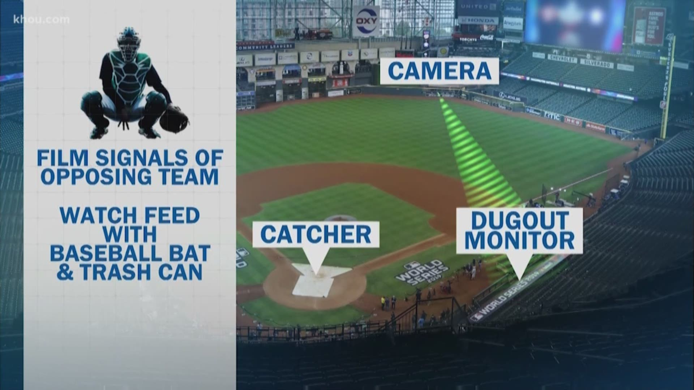
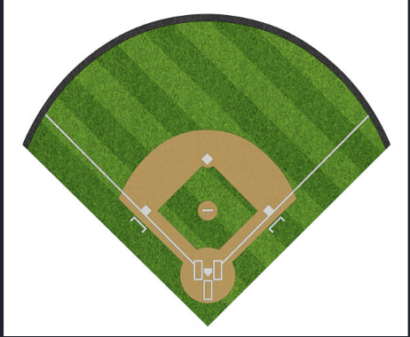
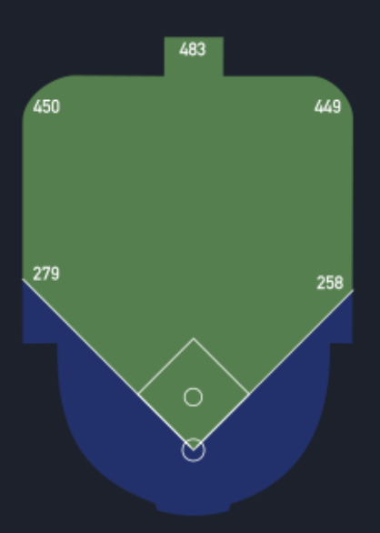
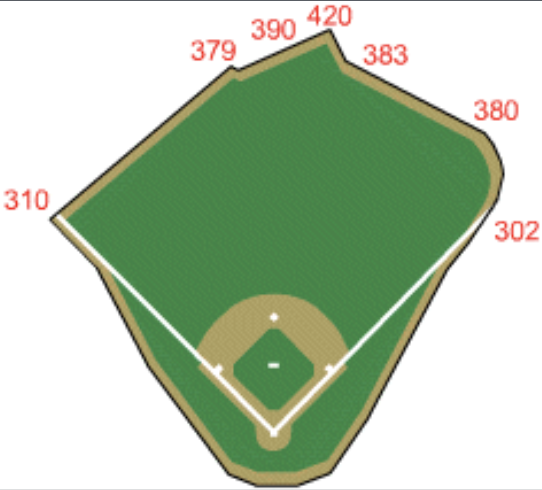
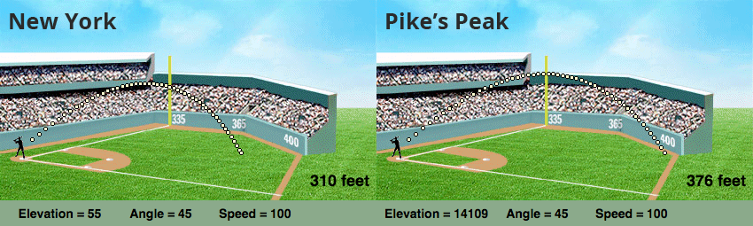
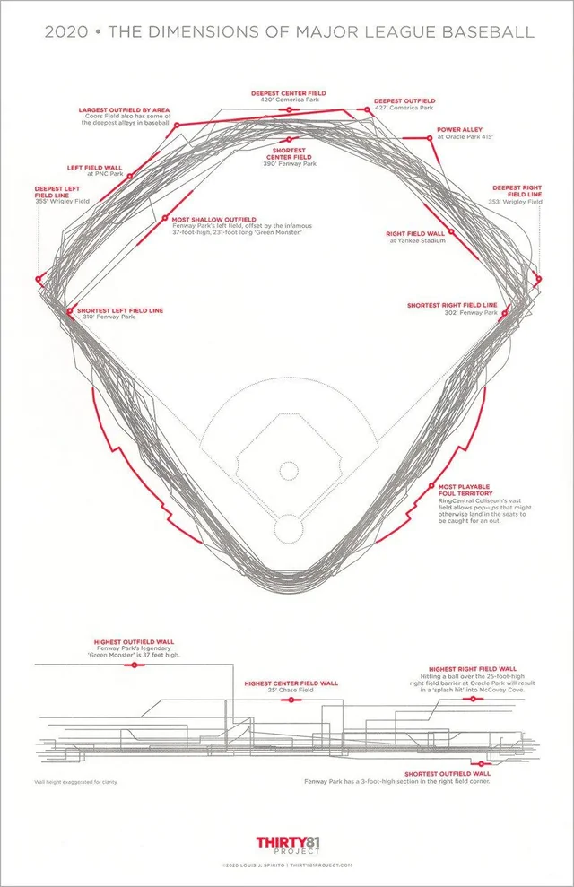
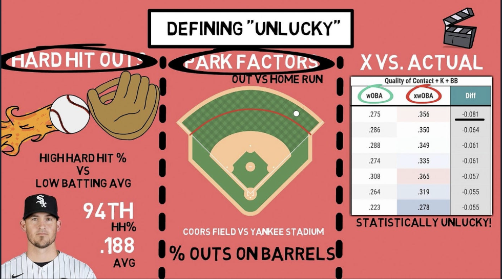

```{r, include=FALSE}
knitr::opts_chunk$set(message = FALSE, warning = FALSE, echo = FALSE)
```


```{r, echo=FALSE}
library(ggplot2)
library(tidyverse)
library(baseballr)
library(showtext)
library(mlbplotR)
library(scales)
library(patchwork)
```

```{r, message = FALSE }
# get park data
ballparks_stadium_data <- read_csv("data/ballparks_stadium_data_2022.csv")
```

```{r, message = FALSE}
# get downloaded hitter stats
`2022HitterStats` <- read_csv("data/2022HitterStats.csv")
```

```{r, message=FALSE}
#Join 2022HitterStats to mlb_stats
Player_team_info <- mlb_stats(stat_type = 'season', stat_group = 'hitting', season = 2022) |>
  select(player_id, team_name, league_name)


Full_22_Hitter_stats <- `2022HitterStats` |>
  left_join(Player_team_info, join_by(player_id))

```

```{r, message = FALSE}
# join park stats and hitting stats
player_and_park_stats <- Full_22_Hitter_stats |>
  left_join(ballparks_stadium_data) 
```

```{r, message=FALSE}
#joined_stadium_data with with Full_22_Hitter_stats
joined_stadium_data <- ballparks_stadium_data |>
  left_join(Full_22_Hitter_stats, join_by(team_name))
```


Baseball is a sport with a long, decorated, and often controversial history. Invented over 180 years ago, it has witnessed scandal and revolution alike. In 1919, the infamous “Chicago Black Sox” scandal saw eight members of the Chicago White Sox bribed by the mob to intentionally lose the World Series. In 1989, Pete Rose—one of the game’s greatest hitters—was banned from the MLB for betting on games while managing the Cincinnati Reds. More recently, in 2019, the Houston Astros were found guilty of stealing signs using an outfield camera, a scheme that played a key role in their 2017 World Series win.

|  |  |  |
|:---------------------------------------------:|:-----------------------------------------------:|:-------------------------------------------------:|
| *Chicago White Sox Scandal (1919)*            | *Pete Rose and the Cincinnati Reds Scandal (1989)*      | *Houston Astros Sign-Stealing Scandal (2019)*     |


<br><br>While baseball’s past is marked by these controversial episodes, the sport has also evolved dramatically—particularly in the 21st century—thanks to a growing reliance on advanced analytics. Popularized by the 2011 film [Moneyball](https://www.youtube.com/watch?v=0h19anH4MdE), statistical analysis has revolutionized the way coaches and executives evaluate players and make strategic decisions. This shift toward data-driven thinking has not only reshaped front office priorities but also deepened our understanding of the game's hidden variables. One such variable—often overlooked but increasingly important—is the concept of park factors. In the next section, we explore how the unique characteristics of each stadium interact with modern analytics to shape player performance and game outcomes.

<br><br>**1.  How Do Ballparks Influence Offensive Performance?**

Baseball is unique among major sports in that each team’s home field can vary significantly in its dimensions and environmental conditions. Unlike the standardized courts in basketball or the fixed-size fields in football, Major League Baseball stadiums are anything but uniform. While typical field dimensions are roughly 400 feet to center field and 330 feet down the foul lines, many ballparks deviate — sometimes dramatically.

Take Fenway Park, for instance: one of the oldest and most iconic stadiums in the league. Its left field foul line is just 310 feet from home plate, but what it lacks in distance it makes up for with the towering 37-foot “Green Monster” wall — a feature that turns routine fly balls into doubles and frustrates hard-hit line drives. Meanwhile, the oddly-shaped right field curves out to just 302 feet, making it the shortest in Major League Baseball. These quirks create a unique offensive environment.

Or consider the now-demolished Polo Grounds, where center field stretched a staggering 483 feet from home plate — far deeper than any modern stadium — while the foul poles hugged the lines at only 258 feet. These contrasting examples (shown below) highlight how dramatically ballparks can differ.


|  |  |  |
|:-------------------------------:|:-------------------------------:|:-------------------------------:|
| *Typical Dimensions of a Field: Center Field (~400 feet), Corners (~330 feet) — a baseline comparison for most modern stadiums.*                     | *Polo Grounds: Known for its extreme dimensions — just 258 feet down the lines but a staggering 483 feet to center — making it one of the most unusually shaped stadiums in MLB history.*                    | *Fenway Park: Famous for its asymmetry, with a short 310-foot left field and the iconic 37-foot-high “Green Monster,” along with a shallow 302-foot right field — all of which create unique gameplay challenges and advantages.*                      |


<br><br>These physical characteristics — including outfield distance, wall height, foul territory, and elevation — are collectively known as park effects, and they play a significant role in shaping offensive performance. Whether it’s a long fly ball that clears the fence in one stadium but dies at the warning track in another, the ballpark itself becomes an active participant in the game.

In the following sections, we explore several of the most influential park effects — focusing specifically on elevation, extra outfield distance, and home run park factor — to better understand how ballparks shape the game’s offensive metrics.


<br><br>***1.1.  The Role of Elevation***

One of the most important — yet often overlooked — physical features influencing offense is elevation. Ballparks located at higher altitudes, such as Denver’s Coors Field, have thinner air due to lower atmospheric pressure. This reduced air resistance allows baseballs to travel farther, increasing the likelihood of extra-base hits and home runs. As a result, elevation can significantly inflate offensive statistics, making it essential to consider when comparing player performance across different ballparks.

|  |
|:-------------------------------:
| *Elevation Affects Offensive Outcomes*|


To illustrate this, the figure below shows the distribution of stadium elevations across Major League ballparks, highlighting the stark contrast between high-altitude parks and those at or near sea level.

```{r}
library(ggplot2)
library(patchwork)

# Calculate mean elevation
mean_elev <- mean(ballparks_stadium_data$elevation, na.rm = TRUE)

# Density plot (no caption)
p1 <- ggplot(joined_stadium_data, aes(x = elevation)) +
  geom_density(fill = "#4682B4", alpha = 0.7, color = "#333333", linewidth = 0.8) +
  geom_vline(xintercept = mean_elev, color = "#D62728", linetype = "dashed", linewidth = 1) +
  annotate("text", x = mean_elev + 100, y = 0.0008, label = "Mean Elevation", 
           color = "#D62728", hjust = 0, size = 3.5, fontface = "italic", family = "sans") +
  labs(
    title = "Distribution of Ball Park Elevation Across MLB Parks",
    x = NULL,
    y = "Density"
  ) +
  theme_minimal(base_family = "sans") +
  theme(
    plot.title = element_text(size = 14, face = "bold", hjust = 0.4),
    axis.title = element_text(size = 10, hjust = 0.1, face = "bold"),
    axis.text = element_text(color = "#333333"),
    panel.grid.minor = element_blank()
  )

# Box plot
p2 <- ggplot(joined_stadium_data, aes(x = elevation)) +
  geom_boxplot(fill = "#FFD700", alpha = 0.7, color = "#444444", width = 0.3) +
  labs(x = "Elevation (feet)", y = NULL) +
  theme_minimal(base_family = "sans") +
  theme(
    axis.title.x = element_text(size = 10, face = "bold"),
    axis.text = element_text(color = "#333333"),
    axis.ticks.y = element_blank(),
    axis.text.y = element_blank()
  )

# Combine plots with caption
(p1 / p2) + 
  plot_layout(heights = c(3, 1)) +
  plot_annotation(
    caption = "Source: Ball Park Stadium Data 2022",
    theme = theme(
      plot.caption = element_text(size = 7, hjust = 0, family = "sans")
    )
  )


```
<br><br>While most MLB stadiums are near sea level, averaging around 500 feet, Chase Field (1,110 ft) and especially Coors Field (5,277 ft) sit at noticeably higher elevations. Only Coors Field, however, stands out as a statistical outlier.


<br><br>***1.2.  Extra Distance in the Outfield***

Beyond elevation, the distance from home plate to the outfield walls — or “extra distance” — plays a significant role in determining offensive success. Ballparks with deeper outfields tend to suppress home runs, giving pitchers an edge by demanding greater power to clear the fences. On the other hand, parks with short porches or shallow gaps can inflate home run totals and alter hitting strategies.

|  |
|:-------------------------------:
| *Extra Distance Affects Offensive Outcomes*|

The following figure explores the distribution of extra distance across MLB stadiums, helping us visualize how varying field dimensions contribute to the offensive landscape.


```{r}
# Calculate mean extra distance
mean_extra_distance <- mean(joined_stadium_data$extra_distance, na.rm = TRUE)

# Density plot
p1 <- ggplot(joined_stadium_data, aes(x = extra_distance)) +
  geom_density(fill = "#6CA6CD", alpha = 0.7, color = "#2F4F4F", linewidth = 0.8) +
  geom_vline(aes(xintercept = mean_extra_distance), 
             color = "#D62728", linetype = "dashed", linewidth = 1) +
  annotate("text", 
           x = (mean_extra_distance + 1), 
           y = 0.08, label = "Mean Distance", 
           hjust = -0.1, color = "#D62728", size = 3.5, fontface = "italic", family = "sans") +
  labs(
    title = "Distribution of Ball Park Extra Distance Across MLB Parks",
    y = "Density",
    x = NULL
  ) +
  theme_minimal(base_family = "sans") +
  theme(
    plot.title = element_text(size = 14, face = "bold"),
    axis.title = element_text(color = "#333333", size = 10, hjust = 0.2, face = "bold"),
    axis.title.x = element_text(size = 10),
    axis.text = element_text(color = "#333333"),
    panel.grid.minor = element_blank()
  )

# Box plot
p2 <- ggplot(joined_stadium_data, aes(x = extra_distance)) +
  geom_boxplot(fill = "#FFD700", alpha = 0.7, color = "#444444", width = 0.3) +
  labs(x = "Extra Distance (yards)", y = NULL) +
  theme_minimal(base_family = "sans") +
  theme(
    axis.title.x = element_text( size = 10, face = "bold"),  
    axis.text = element_text(color = "#333333")
  )

# Combine density plot with caption at the bottom
(p1 / p2) + 
  plot_layout(heights = c(3, 1)) +
  plot_annotation(
    caption = "Source: Ball Park Stadium Data 2022",
    theme = theme(
      plot.caption = element_text(size = 7, hjust = 0, family = "sans")
    )
  )


```
<br><br>Most stadiums vary by only a few yards in total outfield distance, with the league average hovering just below zero. However, a few parks stand out with significantly larger outfields. These include the Colorado Rockies’ Coors Field (+22 yards), the Arizona Diamondbacks’ Chase Field (+13.2 yards), and the Texas Rangers’ Globe Life Field (+7.2 yards), all of which offer considerably more space for outfielders to cover. 


<br><br>***1.3.  Understanding Park Factor***

Lastly, park factors — also known as park effects — serve as a composite metric that aggregates the various physical characteristics we've explored, such as elevation and outfield size, into a single value. These factors also account for other stadium-specific influences like weather and altitude. Calculated using historical data on runs, hits, and home runs, park factors quantify how much a ballpark amplifies or suppresses offensive performance relative to the league average. A value above 100 suggests a hitter-friendly environment, while a value below 100 indicates a pitcher-friendly park.

The chart below displays the distribution of park factors across MLB stadiums, offering a clearer picture of how each park may shape in-game performance.

```{r}
# Calculate the mean park factor
mean_hr_pf <- mean(joined_stadium_data$hr_park_effects, na.rm = TRUE)

# Density plot
p1 <- ggplot(joined_stadium_data, aes(x = hr_park_effects)) +
  geom_density(fill = "#7BAFD4", alpha = 0.7, color = "#2F4F4F", linewidth = 0.8) +
  geom_vline(xintercept = mean_hr_pf, color = "#D62728", linetype = "dashed", linewidth = 1) +
  annotate("text",
           x = mean_hr_pf + 4, 
           y = 0.75 * max(density(joined_stadium_data$hr_park_effects, na.rm = TRUE)$y),
           label = "Mean Park Factor", color = "#D62728",
           hjust = 0, size = 3.5, fontface = "italic", family = "sans") +
  labs(
    title = "Distribution of Home Run Park Effects Across MLB Stadiums",
    x = NULL,
    y = "Density"
  ) +
  theme_minimal(base_family = "sans") +
  theme(
    plot.title = element_text(size = 14, face = "bold"),
    axis.text = element_text(color = "#333333"),
    axis.title = element_text(size = 10, face = "bold"),
    axis.title.y = element_text(hjust=0.1),
    panel.grid.minor = element_blank()
  )

# Box plot
p2 <- ggplot(joined_stadium_data, aes(x = hr_park_effects)) +
  geom_boxplot(fill = "#FFD700", alpha = 0.7, color = "#444444", width = 0.3) +
  labs(x = "Park Factor", y = NULL) +
  theme_minimal(base_family = "sans") +
  theme(
    axis.title.x = element_text( size = 10, face = "bold"),
    axis.text = element_text(color = "#333333"),
    panel.grid.minor = element_blank()
  )

# Combine with patchwork and add caption at bottom
(p1 / p2) +
  plot_layout(heights = c(3, 1)) +
  plot_annotation(
    caption = "Source: Ball Park Stadium Data 2022",
    theme = theme(
      plot.caption = element_text(size = 7, hjust = 0, family = "sans")
    )
  )

```
<br><br>Park factors at stadiums vary widely, with values ranging from around 75 to as high as 150. Once again, the Rockies’ Coors Field stands out as an extreme outlier — a trend consistent with its high elevation discussed earlier. These physical characteristics likely contribute to its significantly hitter-friendly environment, highlighting how individual factors like altitude and field size combine to influence overall park factor.


<br><br>**2.  Linking Physical Features to Offensive Output**

While it’s clear that ballpark characteristics can influence offense, it’s important to examine how specific variables relate directly to offensive metrics — particularly home run totals. By comparing elevation and outfield distance to the number of home runs hit at each stadium, we can gain insight into which physical attributes have the most measurable impact. These visualizations help move beyond assumptions and allow for a more data-driven understanding of park effects.

|  |
|:-------------------------------:
| *How do Park Factors Account for Discrepancies between Predicted and Actual Offensive Statistics in Major League Baseball?*|


<br><br>***2.1.  Elevation vs. Home Runs***

The first plot explores the relationship between a stadium’s elevation and its total number of home runs. Given that thinner air at higher altitudes reduces drag on a baseball, we expect to see more home runs in elevated stadiums. This visualization allows us to test that hypothesis and spot outliers where home run rates may not align with elevation alone.

```{r, message =FALSE}
#Extra Distance → Home Runs

joined_stadium_data %>%
  filter(!is.na(elevation), !is.na(home_run)) %>%
  group_by(ballpark) %>%
  filter(n() > 0) %>%
  ungroup() %>%
  ggplot(aes(x = elevation, y = home_run, color = ballpark)) +
  geom_point(alpha = 0.8) +
  geom_smooth(method = "lm", se = FALSE, linetype = "dashed") +
  labs(
    title = "The Effect of Elevation on Home Run Totals Across MLB Stadiums",
    caption = "Source: Baseball R 2022 & Ballparks Stadium Data 2022",
    x = "Elevation (in feet)",
    y = "Total Number of Home Runs",
    color = "Ballpark"
  ) +
  theme_minimal(base_family = "sans") +
  theme(
    plot.title = element_text(hjust = 0.1, face = "bold", size = 13),
    axis.title = element_text(face = "bold", size = 10),
    axis.text = element_text(size = 6),
    legend.title = element_text(size = 9, face = "bold", hjust = 0),
    legend.text = element_text(size = 6, hjust = 0),
    plot.caption = element_text(size = 7)
  )


```
While higher elevation typically favors increased home run rates, the number of home runs across most MLB stadiums does not exhibit a clear trend in relation to elevation. Despite Coors Field’s high elevation being an outlier with notably higher home run rates, other stadiums show a relatively consistent number of home runs regardless of their elevation.

<br><br>***2.2. Extra Distance vs. Home Runs***

Next, we examine the relationship between extra distance — the average length from home plate to the outfield wall — and home run totals. Intuitively, greater outfield distance should reduce the likelihood of home runs, while shorter distances typically encourage more. In this context, points below zero indicate stadiums with shorter outfields that might favor home runs, while points above zero suggest larger outfields where hitting home runs is more challenging. This chart highlights whether that trend holds true across MLB parks and identifies any stadiums that defy this expected pattern.

```{r, message =FALSE}
#Extra Distance → Home Runs

joined_stadium_data %>%
  filter(!is.na(extra_distance), !is.na(home_run)) %>%
  group_by(ballpark) %>%
  filter(n() > 0) %>%
  ungroup() %>%
  ggplot(aes(x = extra_distance, y = home_run, color = ballpark)) +
  geom_point(alpha = 0.8) +
  geom_smooth(method = "lm", se = FALSE, linetype = "dashed") +
  labs(
    title = "The Effect of Extra Outfield Distance on Home Run Totals Across MLB Stadiums",
    caption = "Source: Baseball R 2022 & Ballparks Stadium Data 2022",
    x = "Extra Distance (in Yards)",
    y = "Total Number of Home Runs",
    color = "Ballpark"
  ) +
  theme_minimal(base_family = "sans") +
  theme(
    plot.title = element_text(hjust = 0.1, face = "bold", size = 13),
    axis.title = element_text(face = "bold", size = 10),
    axis.text = element_text(size = 6),
    legend.title = element_text(size = 9, face = "bold", hjust = 0),
    legend.text = element_text(size = 6, hjust = 0),
    plot.caption = element_text(size = 7)
  )


```

<br><br>As expected, shorter outfields tend to see more home runs. However, this pattern could be influenced by the fact that most MLB parks have relatively shorter outfields. While we observe more home runs in parks with shorter outfields, this doesn't necessarily mean that extra distance alone drives the home run totals. Additionally, the effect of other factors, like elevation (which only significantly impacts parks like the Colorado Rockies' Coors Field), may be contributing to the observed trends.

<br><br>***2.3. Park Effects v.s Home Runs***

Upon examining the relationship between elevation and home run totals, we found a similar pattern to our analysis of outfield distance. Coors Field, with its notably high elevation, stood out, but most MLB ballparks are located at low elevations, and home run totals across these parks were relatively consistent. This suggests that elevation alone doesn't strongly influence the number of home runs hit in each stadium. Similarly, while the extra distance to the outfield wall in certain parks like Coors Field may initially suggest a suppression of home runs, we observed that the majority of MLB ballparks have relatively shorter outfields. In fact, although we did see slightly more home runs in parks with shorter outfields, the relationship was not strong enough to indicate a clear trend. This could be due to the fact that most MLB parks have shorter outfields in general, so the effect of extra distance becomes less pronounced when looking at the league as a whole.

Both of these analyses — elevation and extra outfield distance — suggest that individual factors like elevation and outfield length may not have as strong an impact on home run totals as we might expect. These results raise the question of whether other environmental influences, such as weather conditions, park-specific dimensions, and overall stadium design, may be interacting in ways we haven’t fully captured yet. To explore this further, we turn to park effect scores, a composite metric that aggregates various stadium characteristics, including elevation and outfield distance. By considering multiple factors together, park effect scores provide a more holistic view of how stadium environments influence home run production across the league.

A park effect score above 100 indicates a hitter-friendly environment, where home runs and runs are more likely to occur due to favorable conditions for batters. On the other hand, a park effect score below 100 signals a pitcher-friendly environment, where home runs and runs tend to be suppressed, making it more challenging for hitters to generate offensive output. By considering multiple factors together, park effect scores provide a more holistic view of how stadium environments influence home run production and offensive performance across the league.


```{r}
# Plot: Home Runs vs Park Effects
ggplot(joined_stadium_data, aes(x = hr_park_effects, y = home_run, color = ballpark)) +
  geom_point(alpha = 0.7) +  
  scale_size_continuous(
    range = c(2, 6),        
    guide = "none"          
  ) +
  labs(
    title   = "Impact of Park Effects on Home Run Totals",
    x       = "Park Factor",
    y       = "Total Number of Home Runs",
    color   = "Ball Park",
    caption = "Source: Baseball Savant 2022 & Ballparks Stadium Data"
  ) +
  theme_minimal(base_family = "sans") +
  theme(
    legend.title = element_text(face = "bold"),
    plot.title   = element_text(hjust = 0.5, face = "bold", size = 12),
    axis.title   = element_text(face = "bold", size = 10),
    axis.text    = element_text(size = 9),
    plot.caption = element_text(size = 7),
    legend.position = "right"
  )


```

<br><br> In examining the relationship between park effect scores (PE scores) and the total number of home runs hit in various ballparks, we observe an intriguing trend. Most ballparks with PE scores lower than 100, which indicate pitcher-friendly environments, tend to have more instances of home runs in comparison to ballparks with higher park effect scores. Specifically, the data reveals that ballparks with PE scores under 100 generally average around 5 to 6 home runs. This suggests that these stadiums, despite being pitcher-friendly, still facilitate some home run production.

However, there is a surprising outlier: a ballpark with a PE score of 150, which, contrary to expectations, only recorded one home run. Given that a higher PE score typically reflects a hitter-friendly environment, where home runs should theoretically be more frequent, this singular home run is quite unexpected and raises questions about the specific factors at play in this particular ballpark. One would anticipate a relatively higher number of home runs from such a hitter-friendly environment, but the data does not reflect this trend.

The overall trend is also shaped by the fact that most MLB ballparks fall into the lower PE score category, indicating that most stadiums are more conducive to pitching than to hitting. This widespread occurrence of lower PE scores in the dataset makes it challenging to discern clear trends, as the majority of ballparks share similar characteristics.


<br><br>**3.  From Ballparks to Batters: Evaluating Performance with wOBA**

After exploring how park features shape overall offensive output, the next logical step is to assess how these environments influence individual player performance. To do this, we turn to wOBA (weighted On-Base Average), a comprehensive offensive metric that assigns value to each outcome (walks, singles, doubles, etc.) rather than treating all times on base equally. Unlike traditional stats, wOBA better captures a player's true offensive contributions.

By comparing actual wOBA to expected wOBA (xwOBA) — which is based on quality of contact (exit velocity, launch angle, etc.) — we can evaluate how much a player's environment may have helped or hurt their results. This progression from park-level analysis to player-level metrics allows us to ask: are some players over- or under-performing expectations because of where they play?

<br><br>***3.1. wOBA Discrepancies by Elevation***

In the first plot, each player’s actual vs. expected wOBA is shown, with color indicating the elevation of their home stadium. This allows us to examine whether high-elevation parks systematically inflate actual performance compared to expected metrics, potentially due to the reduced air resistance at altitude. Points above the line indicate players who are underperforming relative to their expected wOBA, while points below the line represent those who are overperforming. By analyzing the distribution of these points across different elevations, we can explore whether high-elevation parks have a noticeable impact on wOBA outcomes.

```{r, message = FALSE}
ggplot(player_and_park_stats, aes(x = woba, y = xwoba, color = elevation)) +
  geom_point(alpha = 0.8, size = 3) +  # Adjust size and transparency for better visibility
  geom_smooth(method = "lm", se = FALSE, linetype = "dashed", color = "black") +  # Add trend line
  scale_color_gradient(low = "green", high = "red") +  # Color gradient for 'extra_distance'
  labs(
    title = "wOBA vs. xwOBA: How Elevation Influences Offensive Metrics",
    x = "wOBA",
    y = "xwOBA",
    caption = "Source: Baseball Savant 2022",
    color = "Elevation(feet)"  # Label for the color scale
  ) +
  theme_minimal(base_family = "sans") +
  theme(
    plot.title = element_text(hjust = 0.2, size = 14, face = "bold"),
    axis.title = element_text(face = "bold", size = 10),
    axis.text = element_text(size = 7),
    legend.position = "right",
    legend.title = element_text(face = "bold", size = 8),
    legend.key.size = unit(1, "cm")
  )
```

While there is a general mix of points above and below the line — suggesting that wOBA discrepancies exist — the relationship with elevation is not strong. Coors Field, the only high-elevation park in this analysis, shows a near-even split with three players overperforming and two underperforming, indicating that elevation alone does not consistently explain wOBA deviations. This is especially notable given that all other parks in the dataset are at much lower elevations, reinforcing that a single high-elevation stadium isn’t enough to drive a strong overall trend.


<br><br>***3.2. wOBA Discrepancies by Extra Distance***

The second visualization repeats the comparison, now coloring players by the average outfield distance of their home park. If players from parks with shorter outfields tend to outperform expectations, this could indicate that ballpark geometry, rather than just player skill, plays a significant role in shaping statistical outcomes. We would expect that in parks with shorter outfields, players might hit more home runs due to the reduced distance, leading to overperformance in their actual wOBA relative to expected wOBA. Conversely, players in parks with longer outfields might underperform, as more batted balls would likely be caught before clearing the fence. However, the actual results could reveal more subtle interactions between park dimensions and offensive performance, shedding light on how ballpark features affect player statistics.


```{r, message = FALSE}
ggplot(player_and_park_stats, aes(x = woba, y = xwoba, color = extra_distance)) +
  geom_point(alpha = 0.9, size = 3) +  # Adjust size and transparency for better visibility
  geom_smooth(method = "lm", se = FALSE, linetype = "dashed", color = "black") +  # Add trend line
  scale_color_gradient(low = "green", high = "red") +  # Color gradient for 'extra_distance'
  labs(
    title = "wOBA vs. xwOBA: How Extra Distance Influences Offensive Metrics",
    x = "wOBA",
    y = "xwOBA",
    caption = "Source: Baseball Savant 2022",
    color = "Extra Distance(yards)"  # Label for the color scale
  ) +
  theme_minimal(base_family = "sans") +
  theme(
    plot.title = element_text(hjust = 0.2, size = 14, face = "bold"),
    axis.title = element_text(face = "bold", size = 10),
    axis.text = element_text(size = 7),
    legend.position = "right",
    legend.title = element_text(face = "bold", size = 8),
    legend.key.size = unit(1, "cm")
  )
```
Interestingly, our second wOBA comparison plot reveals a counterintuitive trend: players from ballparks with longer outfield distances tend to overperform relative to their expected wOBA. This is unexpected, as deeper outfields are typically thought to suppress offensive production by requiring more power to reach the fences. However, several factors could help explain this pattern. Larger outfields create more space for hits to land, potentially increasing the number of doubles and triples as balls drop in or roll to the wall. Additionally, lower wall heights or unique park geometries might offset the longer distances. It's also possible that players in these environments adjust their hitting strategies, favoring line drives and contact over power, leading to better-than-expected results. This observation challenges traditional assumptions and suggests that ballpark dimensions can interact with player behavior in complex ways.


<br><br>***3.3. Team-Level Trends in wOBA Discrepancies***

To round out our analysis, we expanded our focus from individual player performance to team-level metrics by comparing each team’s actual wOBA versus their expected wOBA. This broader perspective allows us to assess whether entire teams tend to outperform or underperform based on their batted-ball data. To identify which teams we should focus on, we ran tests behind closed doors to pinpoint those with the most significant physical influence from their ballparks. The results highlighted specific teams, which we then plotted to visualize how their actual performance deviated from expectations. Any discrepancies observed at the team level may indicate the cumulative impact of park effects, coaching strategies, or player profiles that are specifically suited to the unique characteristics of their home stadiums. These factors together can shape a team's overall offensive output, showcasing how park dimensions and other physical attributes influence team-level performance


```{r}
library(mlbplotR)
library(dplyr)
library(ggplot2)
library(mlbplotR)
library(dplyr)
library(ggplot2)
library(gridExtra)

# Create mapping of team names to abbreviations
team_abbr_mapping <- tibble::tibble(
  team_name = c(
    "Baltimore Orioles", "Houston Astros", "Los Angeles Dodgers",
    "New York Mets", "New York Yankees", "Seattle Mariners",
    "Toronto Blue Jays", "San Diego Padres"
  ),
  team_abbr = c("BAL", "HOU", "LAD", "NYM", "NYY", "SEA", "TOR", "SDP")
)

# Merge abbreviation into your main data
plot_data <- player_and_park_stats %>%
  inner_join(team_abbr_mapping, by = "team_name")

# Main Plot
main_plot <- ggplot(data = plot_data) +
  geom_abline(slope = 1, intercept = 0, linetype = "dashed", color = "gray40") +
  
  # Use logos with transparency and smaller size
  mlbplotR::geom_mlb_logos(
    aes(x = woba, y = xwoba, team_abbr = team_abbr),
    width = 0.05,
    alpha = 0.8
  ) +
  
  labs(
    title = "Actual vs. Expected wOBA by MLB Team",
    x = "wOBA",
    y = "xwOBA",
    caption = "Source: Baseball Savant 2022"
  ) +
  theme_minimal(base_family = "sans") +
  theme(
    plot.title = element_text(hjust = 0.5, size = 12, face = "bold"),
    axis.title = element_text(face = "bold", size = 8),
    plot.caption = element_text(size = 8, hjust = 0)
  )

# Custom Legend (Manually assigning coordinates for logos and team names)
legend_data <- tibble::tibble(
  team_name = c("Baltimore Orioles", "Houston Astros", "Los Angeles Dodgers", "New York Mets", "New York Yankees", 
                "Seattle Mariners", "Toronto Blue Jays", "San Diego Padres"),
  team_abbr = c("BAL", "HOU", "LAD", "NYM", "NYY", "SEA", "TOR", "SDP"),
  y = c(1, 2, 3, 4, 5, 6, 7, 8),  # Assign arbitrary x positions for the logos
  x= rep(1, 8)  # Keep the y constant to line the logos up horizontally
)

legend_plot <- ggplot(legend_data) +
  mlbplotR::geom_mlb_logos(aes(x = x, y = y, team_abbr = team_abbr), width = 0.1) +  # increased logo size
  geom_text(aes(x = x + 0.5, y = y, label = team_name), hjust = 0, size = 3, family = "sans") +  # smaller font
  xlim(0, 9) +  # Adjust xlim to fit all logos
  theme_void() +
  labs(title = "Team") +
  theme(
    plot.title = element_text(hjust = 0.5, face = "bold", size = 8, family = "sans")
  )

# Combine Plot + Legend
gridExtra::grid.arrange(main_plot, legend_plot, ncol = 2, widths = c(3, 1))

```

<br><br>In the resulting plot, we observe clear deviations from the identity line, highlighting that several teams either overperform or underperform relative to their expected wOBA. By labeling each point with the team name, we can begin to identify broader team-level trends. Notably, teams such as the San Diego Padres, Houston Astros, and New York Mets appear to be overperforming, with actual wOBA values exceeding what would be predicted by their underlying metrics. Conversely, teams like the Seattle Mariners show signs of slight underperformance, suggesting they may not be capitalizing fully on their expected offensive output. These discrepancies invite deeper exploration into coaching strategies, player development, and potential park effects that may contribute to the observed differences.


<br><br>**4.  Highlighting Park Factors with Visual Emphasis**

To deepen this comparison, we created a second version of the team plot in which each team’s point is scaled by its park factor. This allows us to visually emphasize how hitter- or pitcher-friendly environments correlate with discrepancies between actual and expected offensive output. Teams in more hitter-friendly parks may appear further below the identity line, suggesting that the stadium may be inflating results beyond what expected metrics alone would predict.

```{r}
player_and_park_stats |>
  filter(team_name %in% c(
    "Baltimore Orioles", "Houston Astros", "Los Angeles Dodgers", 
    "New York Mets", "New York Yankees", "Seattle Mariners", 
    "Toronto Blue Jays", "San Diego Padres")) |>
  ggplot(aes(x = woba, y = xwoba, fill = team_name, size = hr_park_effects)) +
  
  geom_point(shape = 21, alpha = 10) +  # black outline, filled with team color
  
  geom_abline(slope = 1, intercept = 0, linetype = "dashed", color = "gray40") +
  
  scale_size_continuous(range = c(3, 8), name = "HR Park Effect") +
  scale_fill_brewer(palette = "Set2", name = "Team") +  # using team color fill
  
  labs(
    title = "wOBA vs xwOBA with Park Effects",
    x = "wOBA",
    y = "xwOBA",
    caption = "Source: Baseball Savant 2022"
  ) +
  
  theme_minimal(base_family = "sans") +
  theme(
    plot.title = element_text(face = "bold", size = 14, hjust = 0.5),
    plot.subtitle = element_text(size = 10, hjust = 0.5),
    axis.title = element_text(face = "bold"),
    legend.position = "right",
    legend.title = element_text(face = "bold")
  )


```
<br><br>For the most part, player performance aligns closely with expectations, as many points lie near the identity line. However, there are several notable outliers worth examining.

Before interpreting the deviations, it’s important to recall that a lower Home Run Park Effect score generally corresponds to a less hitter-friendly ballpark. Therefore, players who regularly play in such stadiums might be expected to have a higher xwOBA than wOBA, meaning they are underperforming relative to the quality of their contact and plate discipline. In such cases, we would expect their data points to appear above the dashed line.

Interestingly, this is not always the case in our visualization. In fact, a number of players from low park factor stadiums fall below the dashed line, suggesting that they are actually outperforming their expected metrics. This effect appears more pronounced as wOBA increases, indicating that players with higher offensive output tend to exceed expectations, even in less favorable hitting environments. While these findings complicate the assumption that park factors directly suppress wOBA, the majority of data points still cluster around the identity line, making broad trends difficult to confirm without further statistical testing.


**Takeaways**

Our analysis reveals that while physical ballpark characteristics — such as elevation, outfield distance, and home run park factor — do influence offensive performance, their effects are not always straightforward or predictable. For instance, although higher elevation and larger outfield dimensions are typically associated with increased offensive output, we observed that some players in low-elevation or compact parks still overperform relative to expectations. Similarly, we expected lower Home Run Park Effect (HRPE) scores to correspond with lower wOBA values, but found several players in these parks exceeding their expected performance metrics.

These findings suggest that while park effects play a meaningful role, they interact with a range of other variables — such as individual player skill, team strategy, and even random variation — to shape final outcomes. As such, ballpark characteristics are just one piece of a complex performance puzzle. Future analysis could benefit from integrating more granular batted ball data, weather patterns, or pitcher matchups to further isolate the true impact of park effects on offensive metrics.

**Limitations**

While our analysis provides insight into how specific ballpark characteristics affect offensive performance, several limitations should be noted:

-  ***Single-Year Dataset:*** All data analyzed are from the 2022 MLB season. This narrow timeframe limits the generalizability of our findings, as ballpark effects and player performance may vary significantly across seasons due to roster changes, injuries, and weather conditions.

-  ***Limited Sample Size:*** The analysis includes a subset of players and teams, which may not capture the full range of performance variation or the diversity of ballpark conditions across the league.

-  ***Simplified Metrics:*** We relied heavily on summary statistics like wOBA and xwOBA. While useful, they do not account for all aspects of offensive contribution, such as baserunning, situational hitting, or player tendencies.

-  ***Static Park Factors:*** Park effect metrics such as elevation, wall height, and outfield distance were treated as fixed, though in practice their impact may vary based on weather, time of day, and other transient conditions.

-  ***No Pitching or Defensive Context:*** Our analysis does not account for opposing pitcher quality, defensive efficiency, or other team-level factors that influence outcomes independent of ballpark conditions.

Despite these limitations, the trends observed suggest that park characteristics play a measurable role in shaping offensive statistics, pointing to opportunities for further research using longitudinal and multi-variable models.

["link to presentation and slides"](https://drive.google.com/drive/folders/1vUvX3P241jP0kiU4YI5fv0G8y3W7-lDk?usp=drive_link)

**Sources**

-  [BallPark Stadium Data 2022](https://www.kaggle.com/datasets/paulrjohnson/mlb-ballparks/data)
-  [Baseball Savant 2022](https://baseballsavant.mlb.com/leaderboard/pitch-movement?year=2025&team=&min=q&pitch_type=CU&hand=&x=diff_x_hidden&z=diff_z_hidden&sort=diff_x&sortDir=desc)
-  BaseballR Package

[**Video and Slides Drive**](https://drive.google.com/drive/u/1/folders/1vUvX3P241jP0kiU4YI5fv0G8y3W7-lDk)


